# 2020 iOS Design Examples

# Human Interface Guidelines Highlights

## Branding
https://developer.apple.com/design/human-interface-guidelines/ios/visual-design/branding/

> **Resist the temptation to display your logo throughout your app**. Avoid displaying a logo throughout your app unless it’s necessary for providing context. This is especially important in navigation bars, where a title is more helpful.

> **Incorporate refined, unobtrusive branding.** People use your app to be entertained, get information, or get things done, not to watch an advertisement. For the best experience, subtly incorporate your brand through your app’s design. Using colors from your app icon throughout your interface is one great way to provide context in your app.

> **Defer to content over branding.** Showing a persistent bar at the top of the screen that does nothing but display brand assets means there’s less room for viewing content. Instead, consider less intrusive ways to implement branding, such as using a custom color scheme or font, or subtly customizing the background.

> **Don’t let branding get in the way of great app design. Above all, make your app feel like an iOS app.** Ensure that it's intuitive, easy to navigate, easy to use, and focuses on content. Even if your app is available on other platforms, avoid diluting your design by focusing too much on consistent branding.

## Layout

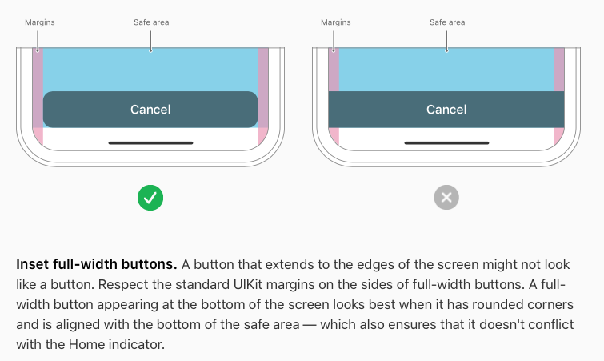
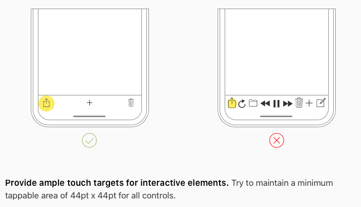

## Color:
https://developer.apple.com/design/human-interface-guidelines/ios/visual-design/color/
> **Provide two versions of your tint color to make sure it looks good in both light and dark modes.** When you use a system color for your tint color, you get automatic support for high contrast

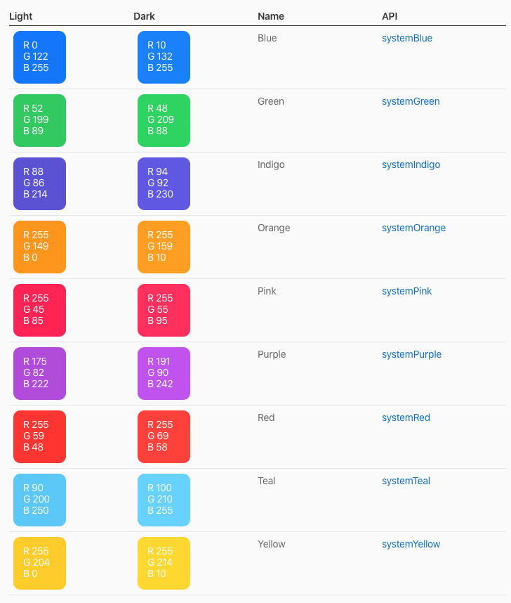

## Dynamic Type
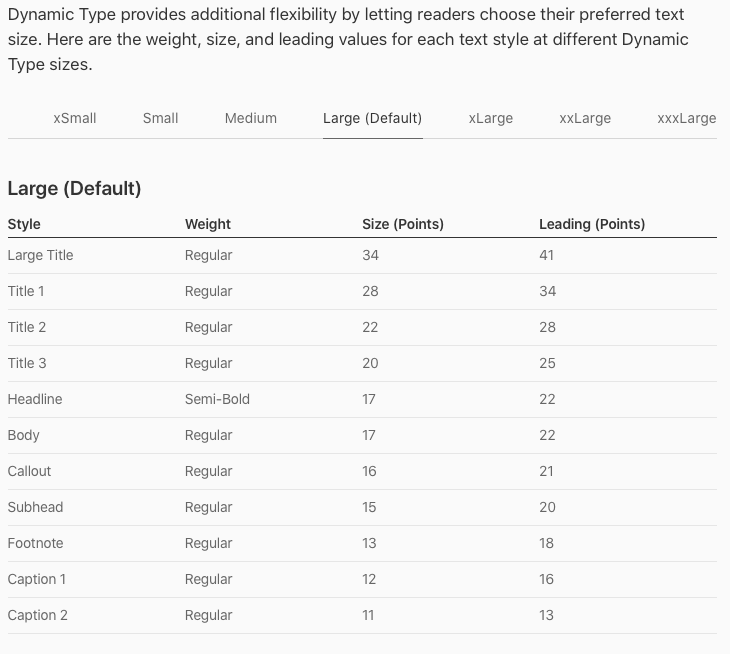

## Video Player

> The system-provided video player offers two viewing modes: full-screen (aspect fill) and fit-to-screen (aspect). By default, the system selects a viewing mode based on a video's aspect ratio, and the user can switch modes during playback. For developer guidance, see AVPlayerViewController.

The system provided player has a lot of great things already built in. Why reinvent the wheel? **By having a custom player with custom controls, expect about 40+ hours of developer time.** Why not just use Apple's player which can be implemented in about 15 minutes? You even get awesome features like AirPlay and Picture in Picture mode to multitask:

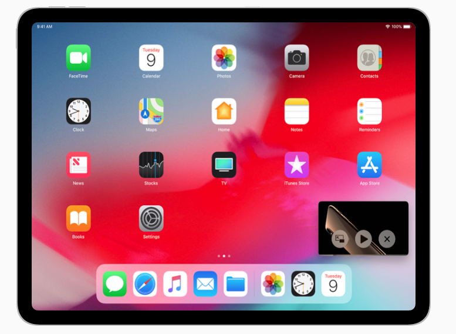

# Slopes App

In the following examples. The area with "Lifetime vertical" and other stats is considered the "Header". The "Content" would start where "2019/2020" label is. 

### Navigation Bar and Header Content

The background of the header flows through all content. Because the background color of the header is the same as the content's background color it can scroll with content, as oppose to collapsing for it. Navigation Bar with a large header collapses (default iOS behavior):

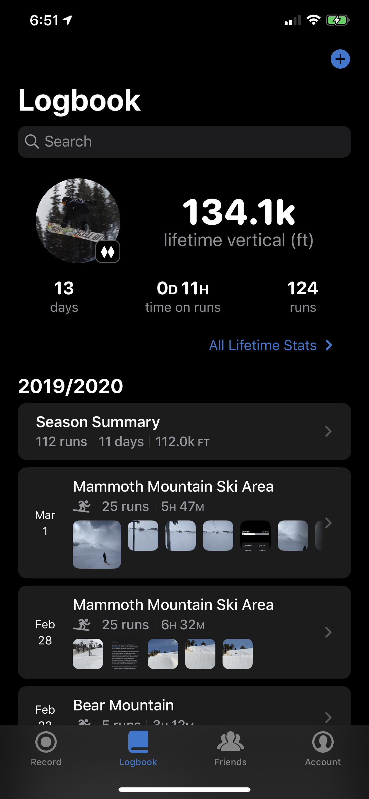

### Making Apple Happy

**Light/Dark Mode** and **Dynamic Font Size:** App is still designed in a way that if font size increased by 50%, the text would't run into each other:

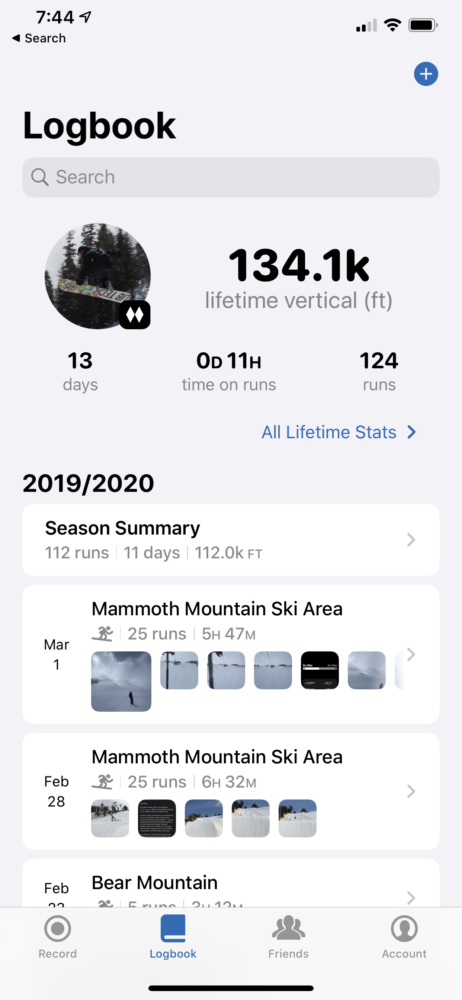
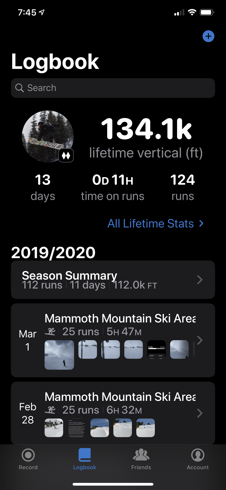

**Alternate App Icons:**

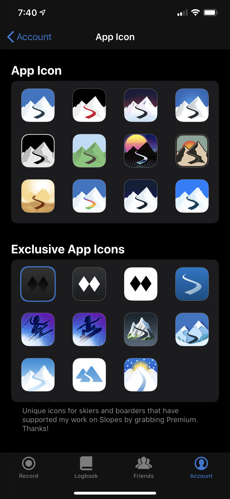

Other notes: 
- No fancy search bar, just the default provided by iOS
- Stock Tab bar at the bottom

# Kickstarter

### Video Playback

Default iOS Player. Supports being embedded in a view and the user can expand to full screen. 
If you want to display other content in the same view as the video, then embed the video int the view but avoid overlaying content on the player. 1 overlay means custom player and A LOT of dev work. In the example below you have something that functions better than what we could do in a reasonable amount of time.

Features:
- Expand to full screen
- Airplay
- Change content mode, letterbox/fullscreen
- Closed Captioning 
- Volume controls
- Playback controls
- Can be used with HLS live streaming
- All FREE

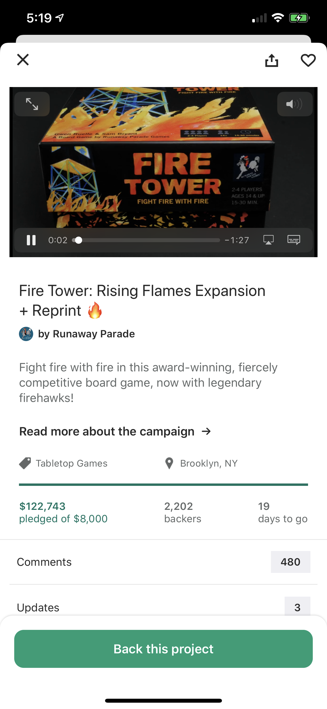

### Onboarding

> Get to the action quickly. After the system replaces your launch screen with your initial app screen, let people dive right in and start enjoying your app. If you need to provide tutorials or intro sequences, give people a way to skip them and don't automatically show them to returning users. https://developer.apple.com/design/human-interface-guidelines/ios/app-architecture/onboarding/

User is taken directly to the app when installed see example of first launch. No onboarding screens, just let users run free and explore. Users will figure out how to sign up when they are ready.

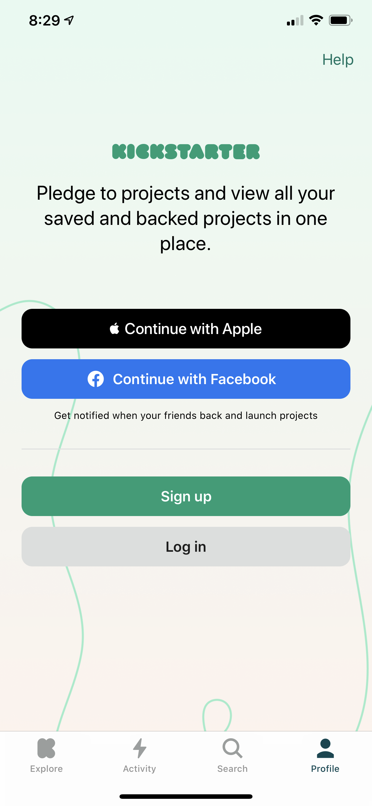

Other notes: 
- Stock Tab bar at the bottom

